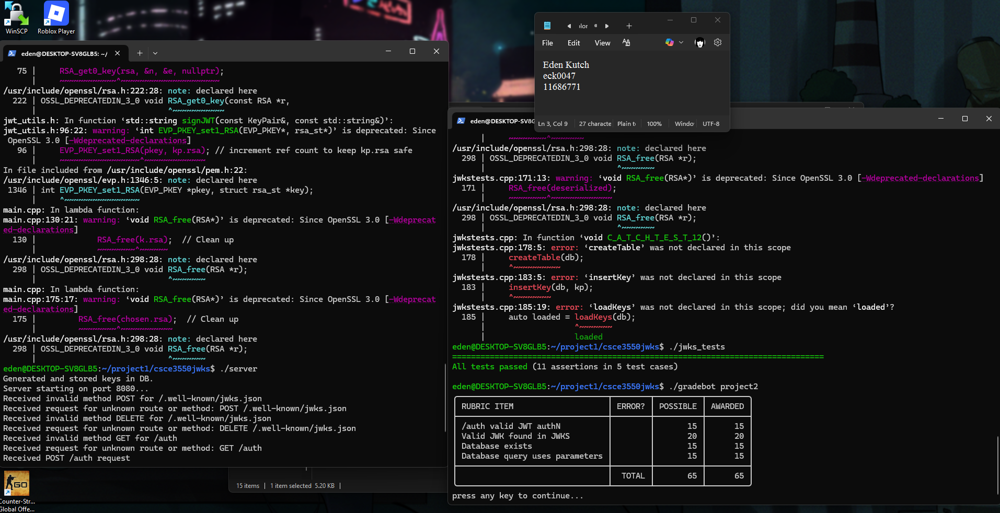
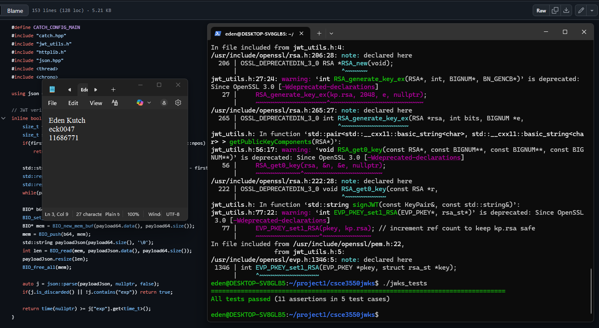

# Server screenshots

# Test suite screenshots

# Summary of Project Process
This project is a JWKS server written in C++ for CSCE 3550, which creates RSA key pairs with unique IDs and expiration times, serves non-expired public keys at /.well-known/jwks.json, and issues JWTs for a fake user at /auth. I used cpp-httplib for HTTP requests and nlohmann/json for JSON handling. The server only allows GET for JWKS and POST for /auth, returning 405 for other methods like PATCH. I used Catch2 to write tests to check key expiration, JWT signing, and HTTP method handling. 
