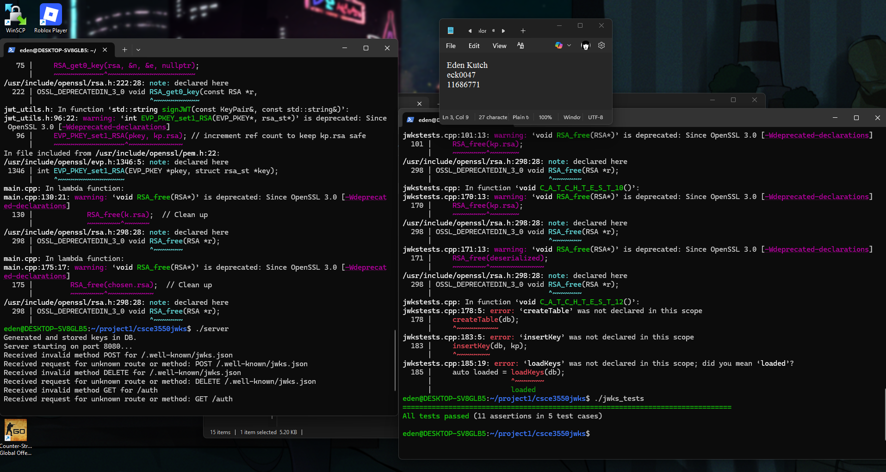

# CSCE3550 Project 2: JWKS Server with SQLite

This project extends the JWKS server from Project 1 to use SQLite for persistent key storage, written in C++ for CSCE 3550. It creates RSA key pairs with unique IDs and expiration times, stores them in `totally_not_my_privateKeys.db`, serves non-expired public keys at `/.well-known/jwks.json` (GET), and issues JWTs for a fake user at `/auth` (POST) with an optional `expired` query parameter. The server uses `cpp-httplib` for HTTP requests, `nlohmann/json` for JSON handling, and `sqlite3` for database operations. Catch2 tests ensure >80% coverage, including SQLite key storage and retrieval.

## Language and Platform
- **Language**: C++
- **Platform**: Ubuntu (WSL), using `g++` compiler
- **Libraries**: `cpp-httplib` (`httplib.h`), `nlohmann/json` (`json.hpp`), `Catch2` (`catch.hpp`), `libsqlite3-dev`, `libssl-dev`

## Setup and Run Instructions
1. **Install dependencies**:
   ```bash
   sudo apt update
   sudo apt install libsqlite3-dev libssl-dev g++
   ```

2. **Compiling and running server**:
   ```bash
   g++ main.cpp -o server -lsqlite3 -lssl -lcrypto
   ./server
   ```

3. **Running tests**:
```bash
   g++ jwkstests.cpp -o jwks_tests -lsqlite3 -lssl -lcrypto
   ./jwks_tests
```

# Test suite screenshots

# Gradebot screenshots

